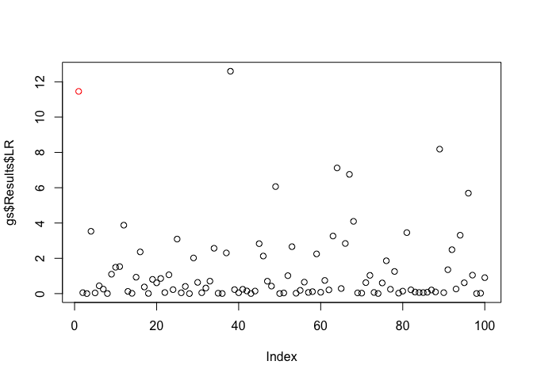
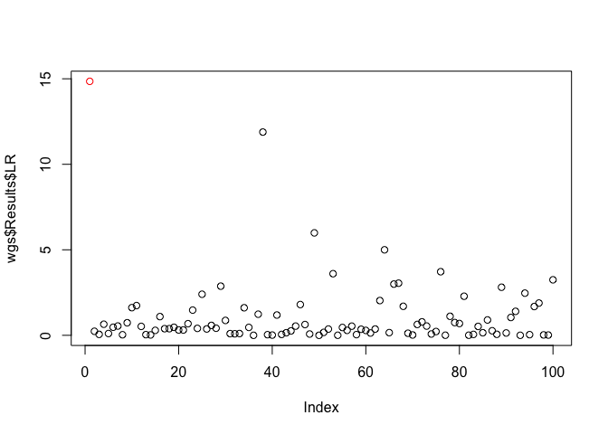
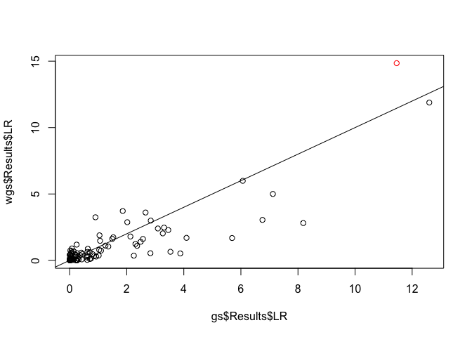

<!-- README.md is generated from README.Rmd. Please edit that file -->

# wISAM

In the course of a genome-wide association study, the situation often
arises that some phenotypes are known with greater precision than
others. It could be that some individuals are known to harbor more
micro-environmental variance than others. In the case of inbred strains
of model organisms, it could be the case that more organisms were
observed from some strains than others, so the strains with more
organisms have better-estimated means.

Package `wISAM` handles this situation by allowing for weighting of each
observation accoding to residual variance. Specifically, the `weight`
parameter to the function `conduct_scan` takes the precision of each
observation (one over the variance).

## Installation

You can install wISAM from github with:

``` r
install.packages("devtools")
devtools::install_github('rcorty/wISAM')
```

or from CRAN with:

``` r
install.packages('wISAM')
```

## Example

Load the package and the example data will be available automatically.
You may want to have a look at the data format and shape with `str()`.
Create a standard genome scan (`gs`, below) or one that uses weights
(`wgs`, below). You can see that this package uses a [reference
class](http://stat.ethz.ch/R-manual/R-devel/library/methods/html/refClass.html)
to implement the GenomeScan object.

``` r
library(wISAM)

gs <- GenomeScan$new(y = phenotype, X = covariate_mat, G = locus_list, K = kinship_mat)
wgs <- GenomeScan$new(y = phenotype, X = covariate_mat, G = locus_list, K = kinship_mat, w = 1/se_mean_per_strain)
```

You can then call `prep_scan`, which computes the quantities that will
only need to be computed once in the course of the genome scan.
Depending on the size of the population, this can be quite slow. The
methods of the GenomeScan reference class return the instance, so you
can chain them together. Unfortunately, this means you will need to wrap
the calls in invisible, or save them to an object to avoid getting a big
print to screen.

``` r
invisible(gs$prep_scan())
#> Preparing GenomeScan...
invisible(wgs$prep_scan())
#> Preparing GenomeScan...
```

You may want to investigate what changed in `gs` and `wgs` when you ran
`prep_scan()`. The next step is to conduct the genome scan.

``` r
invisible(gs$conduct_scan())
#> Conducting GenomeScan...
invisible(wgs$conduct_scan())
#> Conducting GenomeScan...
```

After conducting a scan, you can have a look at the
output.

``` r
plot(x = gs$Results$LR, col = c('red', rep('black', 99)))
```

<!-- -->

``` r
plot(x = wgs$Results$LR, col = c('red', rep('black', 99)))
```

<!-- -->

``` r
plot(x = gs$Results$LR, y = wgs$Results$LR, col = c('red', rep('black', 99)))
abline(a = 0, b = 1)
```

<!-- -->

You can see that the weighted and unweighted version give similar
results, but
